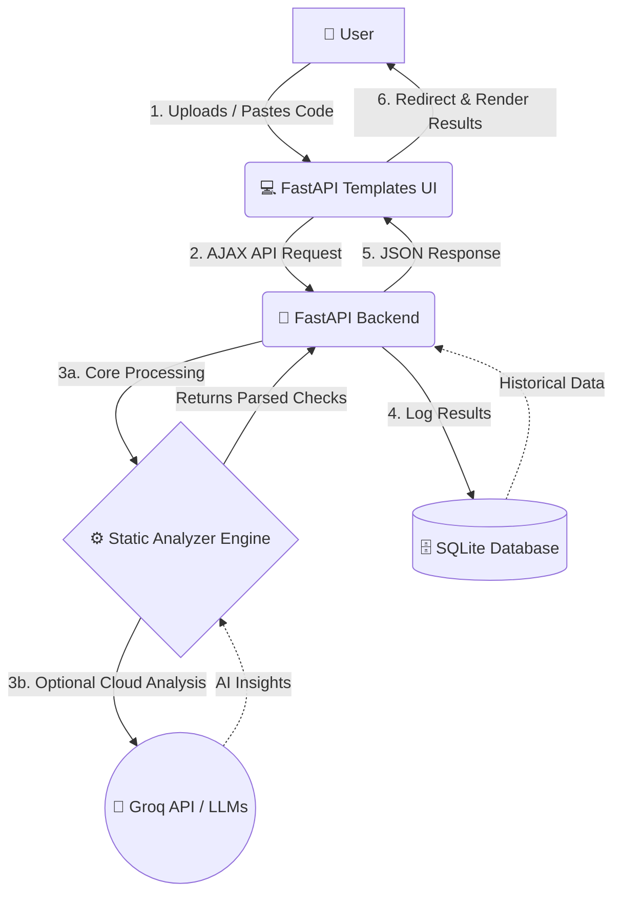

# CodeGuard AI

## 📑 Table of Contents

1. [About the Project](#about-the-project)
2. [Features](#features)
3. [Tech Stack](#tech-stack)
4. [System Architecture](#system-architecture)
5. [Project Structure](#project-structure)
6. [Getting Started](#getting-started)
7. [Deployment](#deployment)
8. [API Endpoints](#api-endpoints) 
9. [Environment Variables](#environment-variables)

---

## About the Project
CodeGuard AI is a full-stack, AI-powered static code analysis tool. It helps developers instantly identify bugs, security vulnerabilities, and code quality issues running entirely locally or optionally via cloud LLMs.

## Features
* **End-to-End Analysis:** Full static code analysis pipeline.
* **AI-Assisted Insights:** Optional deep-dive analysis powered by the Groq API.
* **Secure Authentication:** User log in and registration (API support).
* **Interactive Dashboard:** Clean, responsive UI built with Jinja2 Templates.

## Tech Stack
* **Frontend:** HTML, CSS (Vanilla), JavaScript, Jinja2 Templates
* **Backend:** FastAPI (Python 3.12)
* **Database:** SQLite (Auto-generated)
* **Server:** Uvicorn / Gunicorn

## System Architecture
The application is structured as a unified FastAPI application serving both REST endpoints and server-side rendered HTML templates:



## Project Structure
The repository is structured neatly within a single backend directory for easy deployment:

```text
CodeGuardAI/
│
├── app/                      # Backend application module
│   ├── api/                  # API routing and endpoints
│   ├── models/               # SQLAlchemy ORM definitions
│   ├── schemas/              # Pydantic models
│   ├── services/             # Core business logic
│   ├── analyzers/            # Custom static code analyzer engine
│   ├── utils/                # Helper functions
│   ├── config.py             # Environment configuration
│   ├── templates/            # Jinja2 HTML Templates
│   ├── static/               # Frontend static assets (CSS/JS)
│   └── main.py               # FastAPI entry point
│
├── requirements.txt          # Python dependencies
├── Dockerfile                # Production Docker configuration
├── render.yaml               # Render deployment config
└── .env.example              # Example environment variables
```

## Getting Started
This repository is clone-and-run ready. 

1. Create and activate a virtual environment:
   ```bash
   python -m venv venv
   source venv/bin/activate  # On Windows: venv\Scripts\activate
   ```
2. Install dependencies:
   ```bash
   pip install -r requirements.txt
   ```
3. Start the server:
   ```bash
   uvicorn app.main:app --reload
   ```
*The application is now running locally on `http://localhost:8000`!*

## Deployment
This project is fully ready for deployment on platforms like Render or Railway. 

**Render Configuration:**
The repository includes a `render.yaml` file for instant deployment.
Alternatively, deploy it as a Docker service. The `Dockerfile` uses an optimized `gunicorn` production server.

## API Endpoints
* `POST /login`: Authenticate and receive a JWT.
* `POST /signup`: Register a new user account.
* `POST /analyze`: Submit code snippets for static and AI-assisted analysis.
* `GET /results`: Fetch historical analytics results.
* `GET /`: Serves the web UI.
* `GET /results_page`: Serves the results web UI.

## Environment Variables
If you wish to utilize the optional AI-analysis features, create a `.env` file in the `codeguard-backend` directory:

```env
GROQ_API_KEY=your_actual_key_here
```
If this file is omitted, AI-analysis gracefully skips itself and the application falls back to exclusive static analysis mode.
